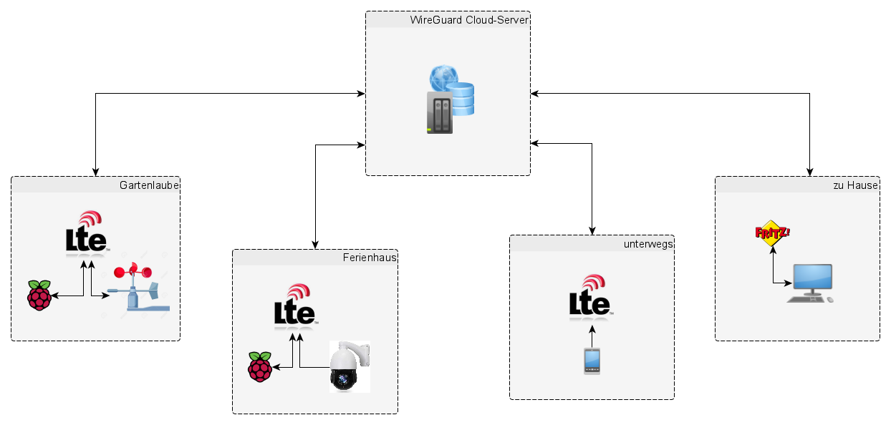

# exampleRaspiWireGuardVPN
Aufbau eines einfachen VPN mittels WireGuard unter Nutzung von mehreren Raspberry Pi und LTE-Routern.
(Setting up a simple VPN with WireGuard using multiple Raspberry Pi and LTE routers.)  
Achtung: Das ist keine Drag-and-Drop Anleitung.  
WireGuard ist ein schnelles, einfaches und modernes VPN-Protokoll. Hier kannst du lesen, wie du ein eigenes VPN-System selbst einrichten kannst. 
**Hintergrundinfos zu WireGuard findest du hier [https://www.wireguard.com/](https://www.wireguard.com/)** 
## Idee ##

**Steuerung der Raspbery Pi und der angeschlossenen Geräte von unterwegs und von zu Hause, mit der Besonderheit, das die Raspberry Pi nur über das Mobilfunknetz erreichbar sind.**
## Ausgangssituation ##
Es gibt nicht überall Internet per Glasfaser. In vielen Regionen komme ich nur über das Mobilfunknetz (per LTE) ins Internet. Die [IPV4-Adressen sind knapp](https://de.wikipedia.org/wiki/IPv4#Adressknappheit) und viele Mobilfunkanbieter stellen deshalb keine öffentlichen IP-Adressen zur Verfügung. Deshalb funktionieren die traditionellen Lösungen mit [DynDNS](https://de.wikipedia.org/wiki/Dynamisches_DNS) nicht mehr.  
Jeder Mobilfunkrouter ist anders und hat mehr oder weniger gute Konfigurationsmöglichkeiten. Daran rumzuspielen macht keinen Spaß. Hier kommt jetzt WireGuard und die Cloud ins Spiel. Wir können ein VPN aufbauen ohne Router konfigurieren zu müssen. Wir benötigen keine [Portweiterleitungen](https://de.wikipedia.org/wiki/Portweiterleitung) und kein DynDNS.
Für WireGuard reicht ein kleiner ["Virtueller Server"](https://de.wikipedia.org/wiki/Virtuelle_Maschine) in einem Rechenzentrum. Uns reichen 500 MB RAM, max. 10 GByte SSD und ein einziger CPU-Kern. Solche Server gibt es schon für unter 5,- Euro im Monat.
Als Betriebssystem unbedingt Linux auswählen, da viel resourcenschonender, einfacher und schneller als Microsoft Windows Server. Außerdem finde ich die [Open-Source](https://de.wikipedia.org/wiki/Open_Source) Idee gut und wichtig!  
Im Folgenden denken wir **Linux**.  
## WireGuard-Tools ##
### wg
> wg ist das Konfigurationsprogramm zum Abrufen und Einstellen der Konfiguration der WireGuard Tunnel Schnittstellen. Die Schnittstellen selbst können mit ip-link hinzugefügt und entfernt werden. Ihre IP-Adressen und Routing-Tabellen können mit ip-address und ip-route konfiguriert werden. Weiterleitungen werden mit iptables konfiguriert.

### wg-quick
> wg-quick ist ein sehr einfaches Skript, mit dem man leicht eine WireGuard-Schnittstelle für typische und einfache Anwendungsfälle einrichten kann. Insbesondere wird es verwendet, um die in einer Konfigurationsdatei [z.B. wg0.conf] eingetragenen Daten umzusetzen. Dabei handelt es sich um Befehle, wie z.B. 
`ip link add …` 
`ip link set … `
`ip -4 route add …`
`iptables -A ...`
Fortgeschrittene Benutzer können mit wg, ip und iptables arbeiten bzw. auch einen vollständigen Netzwerkmanager wie z.B. nmtui, nmcli nutzen oder sich selbst paar Skripte bauen. Damit kann WireGuard für vielfältige Einsatzszenarien konfiguriert werden.

Hier noch ein paar konkrete Befehle als Beispiele, die im weiteren Verlauf eingesetzt werden (wg0 ist der selbst gewählte Name der Konfigurationsdatei. Zur besseren Übersicht verwende ich für den Server wg0, für den Rechner zu Hause wghome und für die Raspberry Pi wgraspi1 und wgraspi2.
- **wg-quick up wg0**  
Dadurch wird die Konfigurationsdatei `/etc/wireguard/wgnet0.conf` geladen/aktiviert.
Der Strip-Befehl ist nützlich, um Konfigurationsdateien neu zu laden, ohne aktive Sitzungen zu unterbrechen:
- **wg syncconf wg0 <(wg-quick strip wg0)**  
Alternativ können Änderungen in der Wireguard-Konfigurationsdatei übernommen werden, indem zuerst die Wireguard-Schnittstelle z.B. mit
- **wg-quick down wg0**  
heruntergefahren bzw. entfernt und anschließend mit
- **wg-quick up wg0**  
wieder hochgefahren wird.

>Weitere Infos zu den WireGuard Tools und zu ip gibt es in den Manpages: man wg und man wg-quick. Die Tools ip und iptables sollte man in Grundzügen kennen, da sie immer wieder benötigt werden.

## Cloud-Server-Installation (Ubuntu-Server) ##
- Server mieten und mit einem Ubuntu-Abbild (am besten 20.04 LTS) erstellen, 
- Firewall konfigurieren (Ports 22 für SSH und 51820 für UDP/WireGuard öffnen),
- als root per SSH anmelden und mit `passwd`das root-Passwort ändern.

### Installation ###
Jetzt vorab schnell noch das System aktualisieren und WireGuard und ein Tool zur Erzeugung von QR-Codes für die Installation von WireGuard auf dem Smartphone installieren: 
```
sudo apt update  && sudo apt upgrade  
sudo apt install wireguard  
sudo apt install qrencode  
```

### Firewall- und Netzwerkeinstellungen
**Firewall des Servers konfigurieren (Port für UDP öffnen)**  
>WireGuard kommuniziert über einen UDP-Port, den du in der Firewall öffnen musst. Den ListenPort für UDP öffnest du z.B. mit ufw allow 51820/udp (geht natürlich nur wenn du  ufw aktiv hast), ansonsten, wie bei uns im IONOS Cloud-Panel mit diversen Klicks! Am besten gleich beim Neuaufsetzen des Servers mit erledigen.

### Kernel-Routing (IP-Forwarding) aktivieren
**IP-Forwarding aktivieren**  
Öffne dafür die Konfigurationsdatei der Kernel-Parameter, mit 
`root@localhost:~# nano /etc/sysctl.conf`
und entferne dort das **"#"**-Zeichen vor der Zeile **net.ipv4.ip_forward=1**
und speichere die Änderungen der Konfiguration, indem du STRG + X danach die "Y"-Taste und anschließend Enter drückst.
Lade die Einstellungen der "sysctl.conf"-Datei nach dieser Änderung neu:
`root@localhost:~# sysctl -p`
Alternativ kannst du auch den Server neu starten, aber wer macht schon so einen Quatsch auf einem Produktivsystem…  ;-)

### Schlüssel erzeugen ###
```
sudo su  
cd /etc/wireguard  
mkdir keys  
wg genkey | tee keys/server_private_key | wg pubkey > keys/server_public_key &&  
wg genkey | tee keys/raspi1_private_key | wg pubkey > keys/raspi1_public_key &&  
wg genkey | tee keys/raspi2_private_key | wg pubkey > keys/raspi2_public_key &&  
wg genkey | tee keys/raspi3_private_key | wg pubkey > keys/raspi3_public_key &&  
wg genkey | tee keys/iphone1_private_key | wg pubkey > keys/iphone1_public_key &&  
wg genkey | tee keys/android1_private_key | wg pubkey > keys/android1_public_key &&  
wg genkey | tee keys/laptop1_private_key | wg pubkey > keys/laptop1_public_key &&   
wg genkey | tee keys/pc1_private_key | wg pubkey > keys/pc1_public_key  
```
